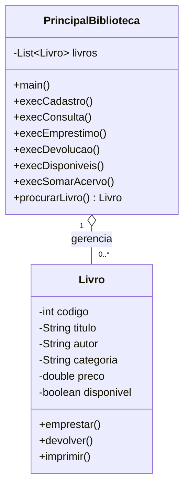

# Atividade Prática — Sistema de Gerenciamento de Livros

## 1. Objetivo

Desenvolver, em Java, uma aplicação de console para gerenciamento de uma pequena biblioteca.

A atividade deverá utilizar os conceitos de Programação Orientada a Objetos trabalhados em aula, incluindo:

- Criação e utilização de classes;
- Criação de objetos;
- Encapsulamento;
- Atributos privados;
- Métodos `get` e `set`;
- `ArrayList`;
- Interface `List`;
- Entrada de dados com `Scanner`;
- Estruturas de repetição;
- Estrutura `switch`;
- Métodos;
- Busca de objetos em uma coleção;
- Retorno de objetos;
- Utilização de `null`;
- Alteração do estado de um objeto;
- Operações realizadas por meio de métodos da própria classe.

---

# 2. Cenário

Uma pequena biblioteca deseja desenvolver um sistema simples para controlar seus livros.

O sistema deverá permitir cadastrar livros, consultar informações de um livro, realizar empréstimos, registrar devoluções, consultar a quantidade de livros disponíveis e calcular o valor total estimado do acervo.

Cada livro deverá possuir informações como:

- Código;
- Título;
- Autor;
- Categoria;
- Preço;
- Situação do livro.

A situação deverá indicar se o livro está atualmente disponível para empréstimo.

O sistema será executado no console e deverá apresentar um menu de opções ao usuário.

## Diagrama de Classe:


---

# 3. Estrutura geral do projeto

Crie um projeto Java contendo, inicialmente, duas classes:

- `Livro`
- `PrincipalBiblioteca`

A classe `Livro` será responsável por representar um livro.

A classe `PrincipalBiblioteca` será responsável pela execução do sistema, interação com o usuário e gerenciamento da coleção de livros.

---

# 4. Etapa 1 — Criar a classe Livro

Crie uma classe chamada `Livro`.

Defina os seguintes atributos privados:

- `codigo` — inteiro;
- `titulo` — texto;
- `autor` — texto;
- `categoria` — texto;
- `preco` — número decimal;
- `disponivel` — booleano.

### Regras

Todos os atributos deverão ser privados.

A classe deverá possuir métodos de acesso e alteração para os atributos.

Crie os métodos necessários para:

- obter o código;
- alterar o código;
- obter o título;
- alterar o título;
- obter o autor;
- alterar o autor;
- obter a categoria;
- alterar a categoria;
- obter o preço;
- alterar o preço;
- verificar se o livro está disponível;
- alterar a situação de disponibilidade.

---

# 5. Etapa 2 — Criar comportamentos para o livro

Além dos métodos `get` e `set`, a classe `Livro` deverá possuir comportamentos próprios.

Crie um método responsável por realizar o empréstimo do livro.

### Regras do empréstimo

Antes de alterar a situação do livro, verifique se ele está disponível.

Se estiver disponível:

- altere a situação para indisponível;
- informe que o empréstimo foi realizado.

Se já estiver emprestado:

- não altere a situação;
- informe que o livro não está disponível.

---

# 6. Etapa 3 — Criar o método de devolução

Crie outro método na classe `Livro` para registrar a devolução.

### Regras

Se o livro estiver emprestado:

- altere sua situação para disponível;
- informe que a devolução foi realizada.

Caso já esteja disponível:

- não altere sua situação;
- informe que o livro já está disponível.

Observe que a própria classe `Livro` deverá ser responsável por controlar seu estado.

---

# 7. Etapa 4 — Criar o método de impressão

Crie um método responsável por apresentar no console todas as informações do livro.

A apresentação deverá mostrar, no mínimo:

- Código;
- Título;
- Autor;
- Categoria;
- Preço;
- Situação.

A situação deverá aparecer de maneira compreensível para o usuário.

Por exemplo:

```text
Disponível
````

ou

```text
Emprestado
```

---

# 8. Etapa 5 — Criar a classe PrincipalBiblioteca

Crie uma classe chamada `PrincipalBiblioteca`.

Essa classe deverá possuir uma lista capaz de armazenar objetos da classe `Livro`.

Utilize:

* a interface `List`;
* a implementação `ArrayList`.

A lista deverá ser um atributo privado da classe.

Inicialmente, a lista estará vazia.

---

# 9. Etapa 6 — Criar o método main

Crie o método `main`.

No início da execução:

1. Crie um objeto `Scanner`;
2. Crie um objeto da classe `PrincipalBiblioteca`;
3. Crie uma variável para armazenar a opção escolhida pelo usuário;
4. Apresente o menu dentro de uma estrutura de repetição.

O menu deverá permanecer sendo apresentado até que o usuário escolha a opção de saída.

---

# 10. Etapa 7 — Criar o menu principal

Crie um menu semelhante ao seguinte:

```text
=================================
       SISTEMA BIBLIOTECA
=================================

1. Cadastrar livro
2. Consultar livro
3. Emprestar livro
4. Devolver livro
5. Consultar livros disponíveis
6. Valor total do acervo
9. Sair

Digite sua opção:
```

Utilize uma estrutura `switch` para executar cada operação.

Caso o usuário informe uma opção inexistente, apresente uma mensagem informando que a opção é inválida.

---

# 11. Etapa 8 — Implementar o cadastro

Crie um método responsável pelo cadastro de livros.

O método deverá:

1. Criar um novo objeto `Livro`;
2. Solicitar ao usuário o código;
3. Solicitar o título;
4. Solicitar o autor;
5. Solicitar a categoria;
6. Solicitar o preço;
7. Definir o livro como disponível;
8. Adicionar o objeto à lista de livros;
9. Informar que o cadastro foi realizado.

Utilize os métodos `set` da classe `Livro` para preencher os dados.

---

# 12. Etapa 9 — Criar o método de busca

Crie um método responsável por localizar um livro pelo código.

O método deverá:

1. Solicitar ao usuário o código do livro;
2. Percorrer a lista utilizando um `for-each`;
3. Comparar o código informado com o código de cada livro;
4. Caso encontre o livro, retornar o objeto encontrado;
5. Caso não encontre, retornar `null`.

### Atenção

O método deverá retornar um objeto `Livro`.

Isso significa que ele poderá retornar:

* um objeto `Livro`, quando encontrado;
* `null`, quando não encontrado.

---

# 13. Etapa 10 — Implementar a consulta

Crie um método para consultar um livro.

Esse método deverá utilizar o método de busca criado anteriormente.

Fluxo esperado:

```text
Solicitar código
       ↓
Procurar livro
       ↓
Encontrou?
   ↙       ↘
 SIM       NÃO
 ↓          ↓
Imprimir    Informar
livro       não encontrado
```

Caso o livro seja encontrado, utilize o método de impressão da classe `Livro`.

Caso contrário, informe que o livro não foi encontrado.

---

# 14. Etapa 11 — Implementar o empréstimo

Crie um método responsável pelo empréstimo de um livro.

O método deverá:

1. Procurar o livro pelo código;
2. Verificar se o objeto foi encontrado;
3. Caso não tenha sido encontrado, informar ao usuário;
4. Caso tenha sido encontrado, solicitar que o próprio objeto realize o empréstimo.

Observe que a classe `PrincipalBiblioteca` localiza o livro, mas o controle da situação do livro deve permanecer na classe `Livro`.

---

# 15. Etapa 12 — Implementar a devolução

Crie um método responsável pela devolução.

O funcionamento deverá ser semelhante ao empréstimo:

1. Procurar o livro;
2. Verificar se foi encontrado;
3. Caso não tenha sido encontrado, informar ao usuário;
4. Caso tenha sido encontrado, solicitar que o objeto realize a devolução.

---

# 16. Etapa 13 — Consultar livros disponíveis

Crie um método que percorra toda a lista de livros.

Para cada livro:

1. Verifique sua situação;
2. Se estiver disponível, apresente suas informações.

Ao final, o sistema deverá permitir identificar quais livros podem ser emprestados.

### Desafio adicional

Crie uma variável para contar quantos livros estão disponíveis.

Ao final, apresente:

```text
Quantidade de livros disponíveis: X
```

---

# 17. Etapa 14 — Calcular o valor do acervo

Crie um método para calcular o valor total dos livros cadastrados.

Percorra todos os livros da lista e some o preço de cada um.

O cálculo deverá considerar todos os livros cadastrados, independentemente de estarem disponíveis ou emprestados.

Ao final, apresente:

```text
Valor total do acervo: R$ XXXXX
```

---

# 18. Etapa 15 — Testar o sistema

Após implementar todas as funcionalidades, realize testes.

Cadastre pelo menos cinco livros.

Exemplo de dados para teste:

| Código | Título         | Autor            | Categoria  |  Preço |
| ------ | -------------- | ---------------- | ---------- | -----: |
| 101    | Java Básico    | Autor A          | Tecnologia |  80,00 |
| 102    | Banco de Dados | Autor B          | Tecnologia |  95,00 |
| 103    | O Hobbit       | J. R. R. Tolkien | Literatura |  60,00 |
| 104    | Clean Code     | Robert Martin    | Tecnologia | 120,00 |
| 105    | Dom Casmurro   | Machado de Assis | Literatura |  45,00 |

Os dados acima são apenas para teste. O aluno poderá utilizar outros livros.

---

# 19. Testes obrigatórios

Realize os seguintes testes:

### Teste 1 — Cadastro

Cadastre cinco livros.

Verifique se todos aparecem corretamente na consulta.

### Teste 2 — Consulta existente

Informe o código de um livro cadastrado.

Verifique se seus dados são apresentados corretamente.

### Teste 3 — Consulta inexistente

Informe um código que não existe.

O sistema deverá informar que o livro não foi encontrado.

### Teste 4 — Empréstimo

Empreste um livro disponível.

Depois consulte o livro e verifique se sua situação foi alterada.

### Teste 5 — Empréstimo novamente

Tente emprestar novamente o mesmo livro.

O sistema deverá impedir o empréstimo.

### Teste 6 — Devolução

Devolva o livro emprestado.

Verifique se sua situação voltou para disponível.

### Teste 7 — Devolução indevida

Tente devolver um livro que já está disponível.

O sistema deverá tratar essa situação adequadamente.

### Teste 8 — Livros disponíveis

Utilize a opção de consulta de livros disponíveis.

Verifique se somente os livros disponíveis são considerados.

### Teste 9 — Valor do acervo

Utilize a opção de cálculo do valor total.

Confira manualmente o resultado.

---

# 20. Requisitos técnicos obrigatórios

O programa deverá obrigatoriamente utilizar:

* Uma classe `Livro`;
* Uma classe `PrincipalBiblioteca`;
* Atributos privados;
* Métodos `get` e `set`;
* Métodos que representem comportamentos do objeto;
* `List`;
* `ArrayList`;
* `Scanner`;
* `for-each`;
* `do-while`;
* `switch`;
* `if/else`;
* `new` para criação de objetos;
* `return`;
* `null`;
* Encapsulamento;
* Objetos armazenados em uma coleção.

---

# 21. O que NÃO deve ser utilizado

Para manter o foco nos conceitos estudados nesta aula, não utilize:

* Banco de dados;
* Arquivos;
* Interface gráfica;
* Frameworks;
* Streams;
* Lambda;
* Collections diferentes de `List`/`ArrayList`;
* Recursos ainda não apresentados em aula.

O objetivo é resolver o problema utilizando os conceitos fundamentais de Java e POO trabalhados nesta aula.

---

# 22. Desafio adicional — Validação de código

Depois de concluir a atividade obrigatória, implemente uma validação para impedir o cadastro de dois livros com o mesmo código.

Antes de adicionar um novo livro à lista:

1. Verifique se já existe um livro com aquele código;
2. Caso exista, não realize o cadastro;
3. Informe ao usuário que o código já está cadastrado;
4. Caso não exista, realize normalmente o cadastro.

Esse desafio deverá reutilizar o conceito de busca de objetos na lista.

---

# 23. Desafio adicional — Relatório

Crie uma nova opção no menu:

```text
7. Relatório da biblioteca
```

O relatório deverá apresentar:

* Quantidade total de livros;
* Quantidade de livros disponíveis;
* Quantidade de livros emprestados;
* Valor total do acervo.

Exemplo:

```text
=================================
       RELATÓRIO DA BIBLIOTECA
=================================

Total de livros: 10
Livros disponíveis: 7
Livros emprestados: 3
Valor total do acervo: R$ 850,00
```

---

# 24. Entrega

Entregue o projeto Java contendo:

* Classe `Livro`;
* Classe `PrincipalBiblioteca`;
* Código-fonte completo;
* Evidências dos testes realizados.

Apresente pelo menos três capturas de tela demonstrando:

1. Cadastro de livros;
2. Empréstimo e devolução;
3. Consulta e relatório.

---

# 25. Critérios de avaliação

| Critério                             |   Pontos |
| ------------------------------------ | -------: |
| Criação correta da classe `Livro`    |      1,0 |
| Encapsulamento e métodos `get`/`set` |      1,0 |
| Utilização de `List` e `ArrayList`   |      1,0 |
| Cadastro de livros                   |      1,0 |
| Busca e consulta                     |      1,0 |
| Empréstimo e devolução               |      1,5 |
| Consulta de disponibilidade          |      0,5 |
| Cálculo do valor do acervo           |      0,5 |
| Menu e controle de fluxo             |      1,0 |
| Tratamento das situações de erro     |      0,5 |
| **Total**                            | **10,0** |

---

# 26. Reflexão final

Após concluir a atividade, responda:

1. Qual é a função da classe `Livro` no sistema?
2. Qual é a função da classe `PrincipalBiblioteca`?
3. Por que a lista foi declarada utilizando `List` e criada utilizando `ArrayList`?
4. Qual é a finalidade do método responsável por procurar um livro?
5. Por que esse método pode retornar `null`?
6. Qual é a vantagem de colocar as operações de empréstimo e devolução dentro da classe `Livro`?
7. O que aconteceria se a lista fosse declarada como um array de tamanho fixo?
8. Qual é a diferença entre alterar o estado de um livro para "emprestado" e remover o livro da lista?
9. Identifique no projeto exemplos de:

   * Classe;
   * Objeto;
   * Atributo;
   * Método;
   * Encapsulamento;
   * Coleção;
   * Estrutura de repetição;
   * Estrutura condicional.
10. Explique, com suas palavras, como um livro cadastrado chega até a lista e posteriormente é localizado pelo sistema.

```
